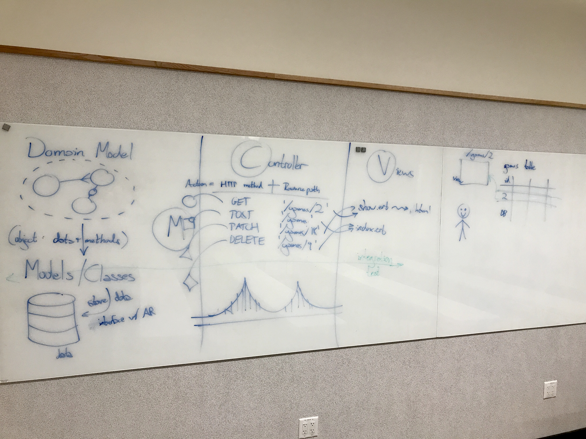
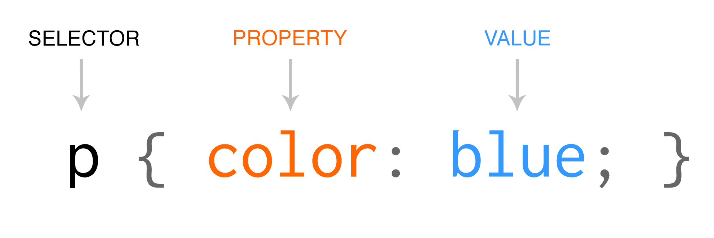

# Sinatra HTML and CSS

## Review of MVC

## HTML & Sinatra

- The layout file (yield)

## Fonts

- Google Fonts

## HTML

- Fundamentals
- Accessibility
  - Semantic HTML introduces meaning to the web page rather than just presentation
  - A way of communicating to different users in different ways
  - https://www.lifewire.com/why-use-semantic-html-3468271

## CSS

- Fundamentals

- Accessibility
- Responsiveness
- Resources
  - http://cssgridgarden.com/
  - https://flexboxfroggy.com/

## Dev Tools
